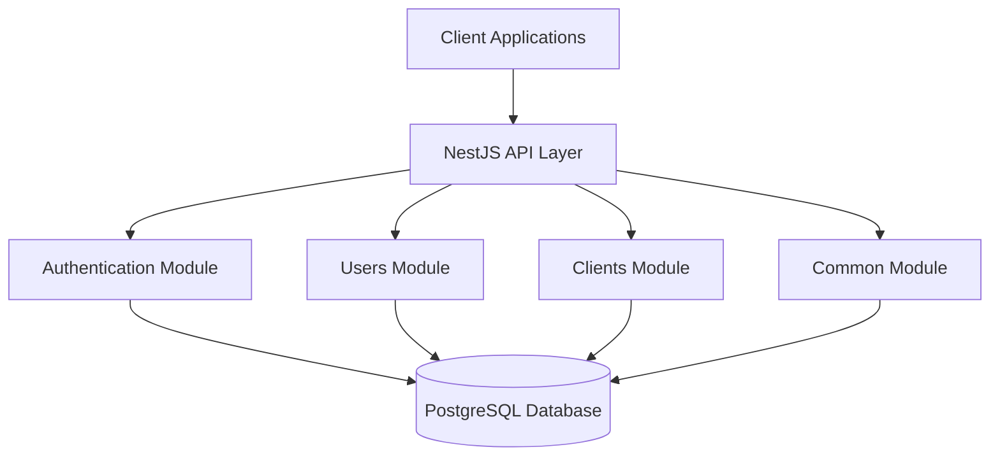
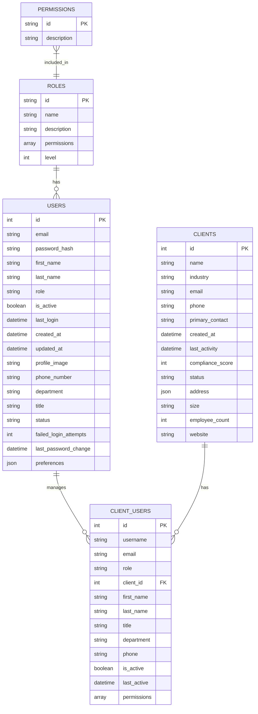

Based on the information gathered, I'll now develop a comprehensive implementation plan for creating a NestJS backend for the GRC application. Let's focus on the core components first, as requested.

# GRC Application Backend Implementation Plan

## 1. Overview

We're building a server backend for a Governance, Risk, and Compliance (GRC) application using NestJS. The application will initially focus on core functionality including authentication and user management, with plans to expand to client management later.

### Key Technologies:
- **Backend Framework**: NestJS
- **Database**: PostgreSQL (using existing Docker setup)
- **Authentication**: JWT-based authentication
- **Process Management**: PM2 for production deployment
- **API Structure**: REST API (with potential for GraphQL expansion)

## 2. System Architecture



## 3. Database Design

### Core Tables:



## 4. Implementation Phases

### Phase 1: Project Setup and Core Infrastructure

1. **Initialize NestJS Project**
   - Set up project structure
   - Configure TypeScript
   - Set up environment configuration
   - Configure database connection

2. **Database Integration**
   - Set up TypeORM
   - Create database migration system
   - Define core database entities
   - Create initial migrations

3. **Common Module**
   - Create utility services
   - Set up logging
   - Implement error handling
   - Create common DTOs and interfaces

### Phase 2: Authentication and User Management

1. **Authentication Module**
   - Implement JWT authentication strategy
   - Create login/logout endpoints
   - Implement password hashing
   - Set up refresh token mechanism
   - Create authentication guards

2. **User Module**
   - Implement user CRUD operations
   - Create user roles and permissions
   - Implement user profile management
   - Set up password reset functionality
   - Create user preferences management

### Phase 3: Client Management

1. **Client Module**
   - Implement client CRUD operations
   - Create client user management
   - Implement client settings and preferences
   - Set up client data validation

### Phase 4: Testing and Deployment

1. **Testing**
   - Write unit tests for core functionality
   - Implement integration tests
   - Set up end-to-end testing

2. **Deployment**
   - Configure PM2 for production
   - Set up CI/CD pipeline
   - Create Docker configuration for deployment
   - Implement database backup strategy

## 5. Detailed Implementation Plan

### Phase 1: Project Setup and Core Infrastructure

#### 1.1 Initialize NestJS Project

```bash
# Install NestJS CLI
npm i -g @nestjs/cli

# Create new NestJS project
nest new grc-server

# Install dependencies
cd grc-server
npm install @nestjs/config @nestjs/typeorm typeorm pg class-validator class-transformer
npm install --save-dev @types/node @types/pg
```

#### 1.2 Project Structure

```
src/
├── app.module.ts              # Main application module
├── main.ts                    # Application entry point
├── common/                    # Common utilities and services
│   ├── dto/                   # Data Transfer Objects
│   ├── interfaces/            # TypeScript interfaces
│   ├── decorators/            # Custom decorators
│   └── filters/               # Exception filters
├── config/                    # Configuration
│   ├── database.config.ts     # Database configuration
│   └── app.config.ts          # Application configuration
├── auth/                      # Authentication module
│   ├── auth.module.ts
│   ├── auth.controller.ts
│   ├── auth.service.ts
│   ├── strategies/            # Authentication strategies
│   └── guards/                # Authentication guards
├── users/                     # Users module
│   ├── users.module.ts
│   ├── users.controller.ts
│   ├── users.service.ts
│   ├── entities/              # User-related entities
│   └── dto/                   # User-related DTOs
└── clients/                   # Clients module
    ├── clients.module.ts
    ├── clients.controller.ts
    ├── clients.service.ts
    ├── entities/              # Client-related entities
    └── dto/                   # Client-related DTOs
```

#### 1.3 Database Configuration

```typescript
// src/config/database.config.ts
import { registerAs } from '@nestjs/config';

export default registerAs('database', () => ({
  type: 'postgres',
  host: process.env.DB_HOST || 'localhost',
  port: parseInt(process.env.DB_PORT, 10) || 5432,
  username: process.env.DB_USERNAME || 'postgres',
  password: process.env.DB_PASSWORD,
  database: process.env.DB_DATABASE || 'grc_db',
  entities: ['dist/**/*.entity{.ts,.js}'],
  synchronize: process.env.NODE_ENV !== 'production',
  logging: process.env.NODE_ENV !== 'production',
  migrations: ['dist/migrations/**/*{.ts,.js}'],
  migrationsRun: true,
}));
```

### Phase 2: Authentication and User Management

#### 2.1 User Entity

```typescript
// src/users/entities/user.entity.ts
import { Entity, PrimaryGeneratedColumn, Column, CreateDateColumn, UpdateDateColumn } from 'typeorm';

@Entity('users')
export class User {
  @PrimaryGeneratedColumn()
  id: number;

  @Column({ unique: true })
  email: string;

  @Column()
  password: string;

  @Column()
  firstName: string;

  @Column()
  lastName: string;

  @Column()
  role: string;

  @Column({ default: true })
  isActive: boolean;

  @Column({ nullable: true, type: 'timestamp' })
  lastLogin: Date;

  @CreateDateColumn()
  createdAt: Date;

  @UpdateDateColumn()
  updatedAt: Date;

  @Column({ nullable: true })
  profileImage: string;

  @Column({ nullable: true })
  phoneNumber: string;

  @Column({ nullable: true })
  department: string;

  @Column({ nullable: true })
  title: string;

  @Column({ default: 'active' })
  status: string;

  @Column({ default: 0 })
  failedLoginAttempts: number;

  @Column({ nullable: true, type: 'timestamp' })
  lastPasswordChange: Date;

  @Column({ type: 'json', nullable: true })
  preferences: any;
}
```

#### 2.2 Authentication Service

```typescript
// src/auth/auth.service.ts
import { Injectable, UnauthorizedException } from '@nestjs/common';
import { JwtService } from '@nestjs/jwt';
import { UsersService } from '../users/users.service';
import * as bcrypt from 'bcrypt';

@Injectable()
export class AuthService {
  constructor(
    private usersService: UsersService,
    private jwtService: JwtService,
  ) {}

  async validateUser(email: string, password: string): Promise<any> {
    const user = await this.usersService.findByEmail(email);
    if (user && await bcrypt.compare(password, user.password)) {
      const { password, ...result } = user;
      return result;
    }
    return null;
  }

  async login(user: any) {
    const payload = { email: user.email, sub: user.id, role: user.role };
    return {
      access_token: this.jwtService.sign(payload),
      user,
    };
  }
}
```

### Phase 3: Client Management

#### 3.1 Client Entity

```typescript
// src/clients/entities/client.entity.ts
import { Entity, PrimaryGeneratedColumn, Column, CreateDateColumn, UpdateDateColumn, OneToMany } from 'typeorm';
import { ClientUser } from './client-user.entity';

@Entity('clients')
export class Client {
  @PrimaryGeneratedColumn()
  id: number;

  @Column()
  name: string;

  @Column({ nullable: true })
  industry: string;

  @Column({ nullable: true })
  email: string;

  @Column({ nullable: true })
  phone: string;

  @Column({ nullable: true })
  primaryContact: string;

  @CreateDateColumn()
  createdAt: Date;

  @Column({ nullable: true, type: 'timestamp' })
  lastActivity: Date;

  @Column({ nullable: true })
  complianceScore: number;

  @Column({ default: 'active' })
  status: string;

  @Column({ type: 'json', nullable: true })
  address: any;

  @Column({ nullable: true })
  size: string;

  @Column({ nullable: true })
  employeeCount: number;

  @Column({ nullable: true })
  website: string;

  @OneToMany(() => ClientUser, clientUser => clientUser.client)
  users: ClientUser[];
}
```

## 6. API Endpoints

### Authentication Endpoints

- `POST /auth/login` - User login
- `POST /auth/logout` - User logout
- `GET /auth/me` - Get current user
- `POST /auth/refresh-token` - Refresh access token

### User Management Endpoints

- `GET /users` - Get all users
- `GET /users/:id` - Get user by ID
- `POST /users` - Create new user
- `PUT /users/:id` - Update user
- `DELETE /users/:id` - Delete user
- `PATCH /users/:id/password` - Update user password
- `GET /users/roles` - Get all roles
- `GET /users/permissions` - Get all permissions

### Client Management Endpoints

- `GET /clients` - Get all clients
- `GET /clients/:id` - Get client by ID
- `POST /clients` - Create new client
- `PUT /clients/:id` - Update client
- `DELETE /clients/:id` - Delete client
- `GET /clients/:id/users` - Get client users
- `POST /clients/:id/users` - Add user to client
- `DELETE /clients/:id/users/:userId` - Remove user from client

## 7. Scalability Considerations

1. **Database Optimization**
   - Implement connection pooling
   - Use indexes for frequently queried fields
   - Consider read replicas for scaling read operations

2. **Application Scaling**
   - Use PM2 cluster mode to utilize multiple CPU cores
   - Implement caching strategies (Redis)
   - Consider horizontal scaling with load balancing

3. **Monitoring and Performance**
   - Implement application metrics collection
   - Set up performance monitoring
   - Use logging for debugging and auditing

## 8. Security Considerations

1. **Authentication and Authorization**
   - Implement JWT with appropriate expiration
   - Use refresh tokens for extended sessions
   - Implement role-based access control

2. **Data Protection**
   - Encrypt sensitive data at rest
   - Use HTTPS for all communications
   - Implement input validation and sanitization

3. **API Security**
   - Implement rate limiting
   - Use CORS protection
   - Add request validation

## 9. Next Steps

1. Set up the initial NestJS project structure
2. Configure database connection and create initial entities
3. Implement authentication module
4. Create user management functionality
5. Develop client management features
6. Implement testing and deployment pipeline